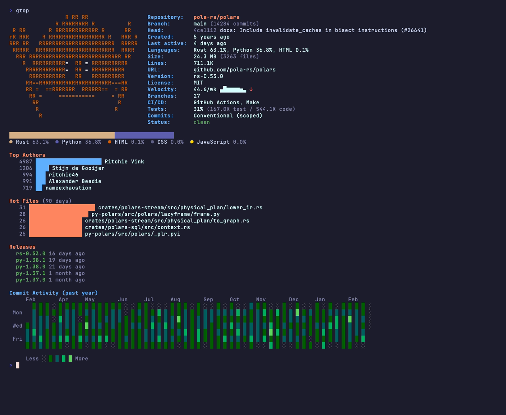
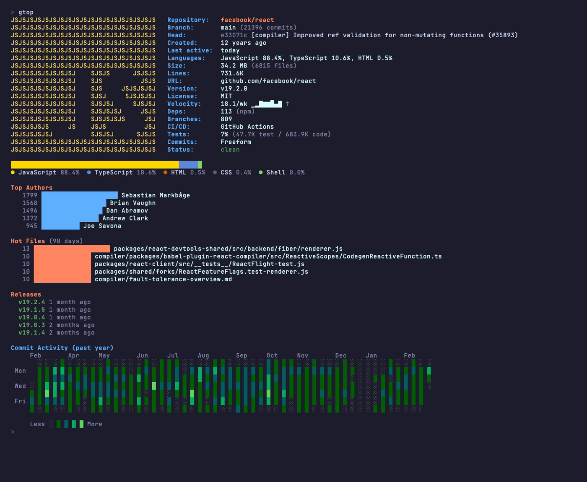

# gtop

A fast, zero-config, terminal-based git repository information tool. Think [onefetch](https://github.com/o2sh/onefetch) meets [neofetch](https://github.com/dylanaraps/neofetch) — displays a rich summary of any git repo at a glance.

## Features

- **Repository info** — branch, head commit, remote URL, working tree status
- **Language-based ASCII logos** — shows the primary language's icon (15 languages, adapted from [onefetch](https://github.com/o2sh/onefetch))
- **Language breakdown** — colored proportional bar with percentages (weighted by file size)
- **Top contributors** — bar chart of most active authors by commit count
- **Lines of code** — total across all detected source files
- **Repo age & last activity** — human-readable timestamps
- **License detection** — reads LICENSE/COPYING files and identifies MIT, Apache, GPL, BSD, MPL, and more
- **Version tag** — displays the latest git tag
- **Commit velocity** — average commits/week with sparkline trend over the last 8 weeks
- **Dependency count** — auto-detects Go modules, npm, pip, Cargo, Bundler, Composer, and more
- **Branch health** — total branches, stale branch count (>30 days), ahead/behind default branch
- **CI/CD detection** — detects GitHub Actions, GitLab CI, Jenkins, CircleCI, GoReleaser, Docker, and more
- **Test ratio** — code-to-test ratio with line counts
- **Commit conventions** — detects Conventional Commits, Gitmoji, or Freeform styles
- **Stash count** — shows pending stashed changes
- **Recent releases** — timeline of the last 5 tags with human-readable ages
- **Hot files** — most frequently changed files in the last 90 days with proportional bars
- **Commit heatmap** — GitHub-style contribution graph for the past year (7-row daily grid, 5 intensity levels)

## Install

### Homebrew (macOS/Linux)

```bash
brew install fayssal-elmofatiche/tap/gtop
```

### Windows

Download the latest `.zip` from [Releases](https://github.com/fayssal-elmofatiche/gtop/releases), extract it, and add `gtop.exe` to your `PATH`. Or with Go installed:

```powershell
go install github.com/fayssal-elmofatiche/gtop/cmd/gtop@latest
```

### Go install (requires Go 1.23+)

```bash
go install github.com/fayssal-elmofatiche/gtop/cmd/gtop@latest
```

### Download binary

Pre-built binaries for Linux, macOS, and Windows (amd64/arm64) are available on the [Releases](https://github.com/fayssal-elmofatiche/gtop/releases) page.

### Build from source

```bash
git clone https://github.com/fayssal-elmofatiche/gtop.git
cd gtop
go build -o gtop ./cmd/gtop
```

## Usage

```bash
cd /path/to/any/git/repo
gtop
```

No flags, no config. Just run `gtop` inside a git repository.

```bash
gtop --version   # print version
```

## Screenshots

**polars** (Rust)



**llama.cpp** (C++)


**react** (JavaScript)



## How It Works

gtop is a single-binary CLI tool written in Go. It gathers all data by shelling out to `git` commands — no external libraries for git interaction, no indexing, no caching. This keeps the tool simple and ensures it works with any git version.

**Architecture:**

| Package | Role |
| --- | --- |
| `cmd/gtop/` | Entry point — orchestrates data gathering and output |
| `internal/git/` | All git data extraction via `exec.Command("git", ...)` |
| `internal/ui/` | Terminal rendering — layout, heatmap, bar charts |

**Tech stack:**

- **[Go](https://go.dev/)** — fast compilation, single static binary, cross-platform
- **[Lipgloss](https://github.com/charmbracelet/lipgloss)** — styled terminal output (colors, borders, layout) from the Charm ecosystem
- **[goreleaser](https://goreleaser.com/)** — cross-compilation and release automation (Linux/macOS/Windows, amd64/arm64)
- **git CLI** — all repository data is gathered through standard `git` commands (`log`, `shortlog`, `ls-files`, `status`, `rev-list`, etc.)

**Key design decisions:**

- No interactive TUI — gtop is a one-shot display tool (like neofetch), not a persistent UI (like htop)
- No external git library — shelling out to `git` keeps the binary small and avoids CGO dependencies
- Language detection by file extension weighted by byte size — simple heuristic, no tree-sitter or deep parsing
- All sections are conditionally rendered — if there are no contributors, deps, or hot files, those sections are silently omitted

## Supported Languages

Go, Python, JavaScript, TypeScript, Rust, Java, C, C++, C#, Ruby, PHP, Swift, Kotlin, Shell, HTML, CSS, Lua, Dart, Zig, Haskell, Elixir, Scala

## Supported Package Managers

| File | Manager |
| --- | --- |
| `go.mod` | Go modules |
| `package.json` | npm |
| `requirements.txt` | pip |
| `Pipfile` | pipenv |
| `pyproject.toml` | pyproject |
| `Cargo.toml` | Cargo |
| `Gemfile` | Bundler |
| `composer.json` | Composer |

## Requirements

- **git** must be installed and available in `PATH`
- Works on any terminal that supports ANSI colors (most modern terminals)
- Colors are automatically disabled when output is piped

## Acknowledgements

- **[onefetch](https://github.com/o2sh/onefetch)** — ASCII art language logos are adapted from onefetch's collection (MIT license). onefetch is a fantastic command-line git information tool written in Rust.
- **[neofetch](https://github.com/dylanaraps/neofetch)** — Inspiration for the side-by-side logo + info layout and the one-shot display approach.

## License

MIT
